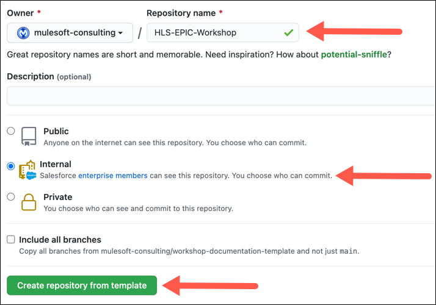

# Workshop Documentation Template

This repository can be used as a template to create documentation for any Mulesoft workshop.  

**NOTE:**
Before you can complete the creation of the documentation you will need to contact the Global SE Team to request a server instance to host the documentation. 

## Tasks to Complete
You will need to complete the following tasks to be able to create documentation for a new workshop.  
1. Clone this repository by clicking on the **Use this template** button.  
 
2. Complete the **Repository name** field, select the **Internal** radio button and then click on the **Create repository from template** button.  

3. From your workstation navigate to a directory that will hold your working Git repository.  
4. Enther the following command to clone the new repository:  
    `gh repo clone mulesoft-consulting/<new_repository_name>`  
5. Edit the following files to tailor your cloned image for the new workshop:  

### At The Root of The Project
| File Name | Required Changes |
|-----------|------------------|
| workshop.yaml | Edit the following values to match the location of the GitHub repository and the target URL for the workshop documentation: `site:title, site:url, content:sources:url`| 
| package.json |Replace the value for `name`  as needed for the new workshop instance.
|Jenkinsfile | Replace the values for `ymlFile, bucket` and `region` as needed for the new workshop instance.|   

### In the \<root\>/docs Directory
| File Name | Required Changes |
|-----------|------------------|
| antorta.yaml | Edit the following values as needed for the new workshop instance: `name:` and `title:`.|

### In the \<root\>/docs/modules Directory
There needs to be a **ROOT** subdirectory and separate subdirectories for each of the lab exercies.  This template has two lab subdirectories named **lab1** and **lab2**.  They should be copied and tailored as necessary to have a separate subdirectory for each of the lab exercises.  

The content of the **ROOT** directory includes the following files and subdirectories:  

| File / Subdirectory Name | Required Changes |
|--------------------------|------------------|
| _attributes.adoc | No changes are required. |
| nav.adoc | This document is used to populate the secondary menu that appears on the left side of the documentation site.  It should be edited to reflect the navigation links and menu option titles for the workshop.

The content of the **ROOT/pages** subdirectory includes the following 3 files:

| File Name | Required Changes |
|-----------|------------------|
| _atrributes.adoc | No changes are required.|
| index.adoc | This is the home page for the documentation.  Edit it as needed to set the scenario that the documentation will lead the reader through.  **NOTE:** Do not edit the `imagesdir: ../assets/images` line at the top of the file. |
| workshop-setup.adoc | This document is used to describe all of the pre-workshop steps that must be completed before starting the workshop.|

The **ROOT/assets/images** subdirectory is used to store all of the **png** images that are used in the documentation.

### In the \<root\>/docs/modules/lab\<1, 2, etc\> Subdirectory
The files and directories in each of the lab subdirectories are similar in content and usage to those found in the **\<root\>/docs/modules/ROOT** directory.  Note that the lab subdirectories do not include a **nav.adoc** file. 

